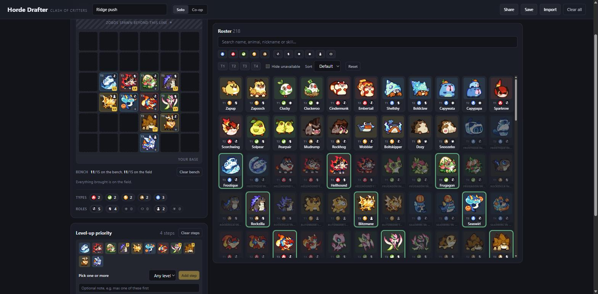

# Horde Drafter - Clash of Critters

<!-- stats-lede:start -->
A planning tool for Clash of Critters' Horde Invasion mode. 2,189 visits so far,
and 651 of those people actually built a formation.
<!-- stats-lede:end -->

Plan your run before you commit to it: drag Tatari onto a 6×6 field, set the
order you want to spend level-ups in, then share the result as a picture or a
link somebody else can open as a template.



## Who uses it

<!-- stats-usage:start -->
| | |
| --- | --- |
| Visits | 2,189 |
| Built a formation | 651 (46% of arrivals) |
| Exported a `.json` | 46 |
| Downloaded a share card | 33 |

About 13% arrive from a Google search, 14% from Reddit and 8% from YouTube. The
rest arrive direct.

About 75% are on a phone, and iOS is roughly 50% of those.
<!-- stats-usage:end -->

Reddit arrivals are mostly the mobile app. The YouTube traffic is mainly Artiar's doing,
shout out to the GOAT for using my tool in a video.

Six things in the changelog exist because players asked for them: the range
indicator toggle and the buff/debuff/heal tracker (@lem77), Horde level-up
skills (u/Nikky-Nami), the boss pull toggle (minhmax0r / @johnlmbui), and a mobile bug where
fielded Tatari vanished (u/R2DKK). Community Formations idea (neko_ironyoffate).

The counts come from [GoatCounter](https://www.goatcounter.com), which records
page views and a short list of fixed button labels. It never sees a formation.

## Use it

**Online:** <https://jeremycanlas.github.io/clash-of-critters-horde-planner/>

**On your own machine:** the app is plain HTML, CSS and JavaScript with no build
step, but browsers block data loading on `file://`, so serve the folder rather
than double-clicking `index.html`:

```bash
git clone https://github.com/jeremycanlas/clash-of-critters-horde-planner.git
cd clash-of-critters-horde-planner
npx --yes http-server . -p 8123 -c-1
```

Then open <http://localhost:8123>. Any static server works, so use
`python -m http.server` if you'd rather not use Node.

Co-op has two options to aid for looking for a teammate: **LF** ("looking for", amber) and
**HAVE** ("I am bringing these", green). Either, neither or both can be filled.

They share one editor rather than taking two rows of controls: a small pair of
buttons picks which line you are adding to, and each carries a count so the one
you are not looking at still shows it has something on it. Both are drawn on the
field, HAVE above LF.

## Changelog

### 1.8.0

#### Changes:
- Chips! All 49 of them are in the tool now, in their own tab next to Tatari and Zobos. Every one has its icon, what it does, its tier and its type, in the same order the game's gallery shows them.
- The chips that read your board tell you what they'd be worth to it. Rear Guard shows you the actual Tatari in your back two rows, not just a number, so you can see whether those are the ones you care about.
- Two views: a list with the full rule on every row, and a grid of just the tiles if you already know them. It remembers which you were using.
- Keep the three you'd take and drag them into the order you'd take them. The chips tab has its own bench for this: two bordered trays, one for the three and one for the shortlist, and you drag chips between them to say what goes first. Pick a chip up anywhere on it and drop it in either tray. Drag one from the three onto the shortlist to move it there, drag it back to promote it, and drag it onto the chip list to stop keeping it. While you're dragging, the tray you're over lights up whole; aim at one of the three instead and a bar appears in the gap it would land in, with that chip stepping aside and wearing the number you're about to take. Arrow keys do the same edits if you'd rather not drag, and Delete drops one.
- Your chips go on the share card too, under the bench, with a line saying they're offered at random rather than chosen.
- Flex slots! Turn on Flex slots and press any empty square to mark it as somebody else's choice. It shows as a dashed square reading FLEX, on the board and on the share card. This is for posting a formation as a template instead of a finished thing.
- The level-up plan says what it's for when it's empty instead of showing nothing at all.
- On a phone the filters fold behind a button with a count on it, so the roster gets the screen instead of the controls for narrowing it.
- Took the em dashes out of everything you can read.

#### Bug Fixes:
- On a card in a line you already bring, "Switch from Frostique" was a bar across the bottom of the card that covered the name and then got cut off to "SWITCH FROM...". You lost both the name and which one you'd be switching from. It's a small arrows icon beside the name now.
- Reset did nothing on the chips tab. It unpressed the buttons and left the filter on, so it looked like it hadn't worked because it hadn't.
- Clear field did nothing if you had no Tatari placed, so flex marks on an otherwise empty board couldn't be cleared. A board showing three FLEX squares is not a clear board.
- Center Spotlight was filed as a position chip and counted your Tatari in the middle two columns. It moves where Zobo bosses spawn and says nothing about your Tatari, so it's a map chip now and scores nothing.
- The grid view of the chips had no picture on the tiles at all, and the names were squeezed to about nine characters next to the tier.

### 1.7.0

#### Changes:
- Added a page that highlights the changes made in the latest patch
- Added a patch filter to see who got buffed, nerfed and adjusted, and a small marker on their card in the roster so you can spot them without filtering
- When a patch lands there's a line at the top of the page pointing at that page, and it goes away once you've read it
- Reworked heals/buff/debuff filters so that you can filter tataris per horde skill level and per specific effect, all 23 of them (Stun, Slow, Shield, ATK Boost and the rest)
- Rearranged the heals/buff/debuff icons in the roster into their own row above the sprite, along with the level they get it, so that nothing the app draws touches a tatari any more
- The filter labels are brighter and High Contrast Mode also changes filter labels now.
- Made more tests so that I don't break things more often (woops!).

#### Bug Fixes:
- You could never drag to reorder the level-up plan on a phone. The browser was reading the gesture as a scroll before the drag even started. Grab the step number and it moves now.
- With a boss pull on (or the Zobo ground open), double-clicking a Tatari out past the contact line didn't send it back to the bench. Turns out nothing worked out there except dragging: you couldn't click a bench chip into those rows either, and the arrow keys stopped at the line. All of it works now.

### 1.6.1

#### Changes:
- Added the new Tatari: the polar bear line (Snowcub, Polarpaw, Blizzgrizz and Anglerbear), plus two new T4s. Dharmadder now caps the Taptail line and Lordopus caps the Dumbopus line. The roster is 230 now.
- Added the six new Zobos: Botanical, Chef, Golf and Totem (bosses), plus Spritz and Retriever. The wiki has no art for them yet, so they show up without pictures for now.
- Picked up glitter art for Blastniff, Gigagnash and Technocan, and an attack range for Cheerstella.
- There's a small "Say thanks" link next to my name in the header now. The tool is free and always will be. Hosting costs nothing, so it's only there if you feel like it.

### 1.6.0

#### (Experimental) Changes:
- Live sessions! You can now build a formation together with someone in real time. Hit the new Live button on the upper right corner, send them the link, and you'll both be dragging the same board around, you'll even see each other's pointers as you move through the field.
- Everything syncs: placements, benches, the level-up plan, sandbox, the zobo ground and both boss pulls all update live on both screens.
- Sessions are capped at 2 people for now. If you open a link to a session that's already full, it just tells you and leaves your own formation exactly as it was.

### 1.5.2

#### Changes:
- Sandbox now allows you to put as many copies of a tatari of any tier as you want (adding to glenthern's suggestion)
- The share grid now shows each Tatari's tier (T1–T4) on the top left of each tatari on the field.
- The share picture now also includes any toggled worm pull/2nd worm pull and the 7x7 zobo ground.
- Tier switching! You can now switch a Tatari's tiers without having to remove them to the roster and the priority plan of that tatari persists. (thanks to @mersite for the suggestion)
- Co-op tatari ownership switch! You can now switch a Tatari's owner from P1 to P2 and vice versa and the priority plan will adjust. (Another one mersite)
- Added a High Contrast Mode accessibility option and the ability to switch between light and dark mode (thanks to ztkz and dyslexicshowerhead for the suggestions and feedback)

#### Bug Fixes:
- Sharing a formation with a boss pull on was broken, opening the link will dump all pulled tataris back to the bench. It should work as intended now

### 1.5.1

#### Changes:
- Allows users to switch between tatari tiers without removing from the field/bench
- In coop mode, allows users to switch fielded tatari between players
- Both changes will keep the priority level up plan for that specific tatari, benched tataris will retain their level up plan it'll just be grayed out.

### 1.5.0

#### Changes:
- Added the new Tatari and it's evolutions
- Added a background img tool, all tataris and it's glitter variants should be backgroundless from now on
- Added a Zobo roster 
- Added a zobo ground toggle to bring out the 7x7 grid above the placeable 6x6 grid.
- Sandbox - Suggested by glenthern from discord. Uncapped Tataris on the field
- Boss pull toggle rebuilt - built the first version when i was a noob idk how it worked HAHAHA but it works now hopefully, thanks to everyone who answered my inquiries in discord.
- Also added a second boss pull toggle


### 1.4.0

#### Summary:

Formations can now be posted where other players can find them. **Community
formations** is a list of builds people chose to publish, and each row is the
whole formation drawn out the field, both benches, the level-up plan and what
it brings. You sign in with Discord to post or upvote; browsing needs no account and sends nothing.

The drafter itself still talks to no server. Community is one page, and it is
the only page in this project that does.

#### Changes:

- **Community formations**, linked from the header. Sorted by newest, upvotes and also filters for T1 - T4.
- **Post a formation publicly.** Save a formation locally then click post to publish it.
- **Upvotes.** Like a formation? give it a thumbs up! and it'll show up higher up in the list.
- **Filters.** Solo/Co-op, and by tier: picking T2 asks for builds whose *best*
  Tatari is a T2, so what you get is a set somebody at that stage could field,
  not a T4 roster with one T2 in it.
- **Your own posts can be renamed and re-worded** without being deleted. The
  formation itself cannot change - that is what people upvoted.
- **Deleting keeps its upvotes for 30 days**, so a mistaken press is survivable,
  and the toast offers Undo. After 30 days it is erased for good.
- **The poster's note is drawn on the card**, in its own panel, along with their
  Discord name and picture. A card saved or pasted into Discord now carries the
  one sentence explaining what the build is for.
- **A one-column card on phones.** The wide card was being scaled to about a
  third on a phone, which put the level-up plan at five pixels. The narrow
  layout is the same content stacked, and everything on it roughly doubles.

#### Bug Fixes:
- Mobile view: Long pressing a tatari from the bench can either allow you to drag and drop a tatari to any bench as intended or asks you if you want to download the image (BOOO!). Users should now be able to long press with ease.

#### Privacy:

- A poster's name and picture now come from Discord's own record of the account
  rather than from account metadata, which the account holder can rewrite. The
  picture also has to be on Discord's own CDN, since it is a URL every reader's
  browser fetches.
- **Sign out.** The Community page shows who you are signed in as, with a Sign
  out beside it, and it ends the session on Supabase rather than only forgetting
  it here. What this browser keeps is a token, so on a shared machine the next
  person could otherwise post and delete as you.
- **Sign-ins do expire.** A session is good for 30 days, or 7 days unused,
  whichever comes first. A nightly job in the database stamps each new session with its end
  date and clears out the spent ones, which takes the recorded sign-in IP with
  them.
- The privacy section below now lists everything signing in stores,the identity
  Discord hands over, and the IP address Supabase records against a session, only if you post and authenticate through discord.

### 1.3.0

#### Summary:

Formations can now be saved in the browser and brought back with one click. On a
desktop the list lives in a drawer behind a **Saved** tab on the right edge of the
screen; on a phone it is a **Saved** button on the bottom bar, opening as a sheet
like the roster and the plan. Each saved formation shows a stamp-sized map of the
actual sprites on the 6×6 field, so you recognise a build by its shape before you
read its name.

#### Changes:

- **Saved formations.** *Save this formation* keeps a snapshot of the field, both
  benches, the level-up plan, the name and the co-op lines in this browser.
  Saving the same name again updates that entry; up to 40 are kept.
- Loading a save replaces what you were working on, and the toast offers **Undo**
  so one stray click cannot cost a draft. Deleting offers the same.
- The save that exactly matches what is on the field is marked **On the field**.
- **Clear all does not touch saved formations.** Coming back to a kept draft
  after wiping the field is the point of keeping one.
- The header's *Save* button is now called **Export**. It still downloads the
  same `.json` file, but "Save" belongs to the in-browser list now, and
  Export/Import read as the pair they are.
- Nothing new leaves the browser: saved formations are `localStorage` only, and
  the only analytics are two fixed labels (`save-kept`, `save-loaded`).

### 1.2.1

#### Summary:

Added the range recorder which is linked from the main page. It records attack, support and debuff ranges without
anyone having to clone the repo, and hands the result to you as a GitHub issue
somebody else can review.

#### Changes:

- The recorder's board is the usual 6x6 field plus the seven rows behind the
  line that shows where the zobos appear.
- A Tatari with more than one reach (an attack range and a support range, say)
  shows both on the same card instead of one per card.
- Verified entries, whether you checked them or another contributor did, draw
  their bar in grey. The tiles an entry would add or remove are coloured
  separately on the board.
- Range entries carry a new `verified` flag.

### 1.2.0
#### Summary:
The phone layout is rebuilt (again). Around 77% of visitors use the tool on a mobile device, and the old
page asked them to scroll past 218 roster cards to get back to the field. So I rebuilt the whole
layout to be mobile-first. The field is now the main view on mobile, and the roster, summary and
plan are overlaid on top. They dismiss again when you're done, and the Tatari you're bringing sit in
a dock pinned above the buttons.

#### Changes:
- **The field owns the screen on a phone.** The roster, summary and level-up plan
  buttons moved to the bottom of the screen, so reaching them no longer means
  scrolling away from the field.
- **More ways to place a Tatari.** Dragging from the bench still works. You can
  now also tap a Tatari on the bench, which lights the cell it would land in;
  tap again to keep that cell, or tap any other cell to use that one instead.
- **Just the grid button**: Hides everything except the field, so your phone's own screenshot catches the formation and nothing else.
- Suggested by @minhmax0r
  - **Boss pull (toggle):** Shows the worm boss dragging the rearmost Tatari of every column to the front. Nothing is moved for real, untoggle and they go back.
- **The level-up plan sequence is now readable on the field.** Every planned Tatari carries
  its step number beside its target level, so the order is visible on the
  formation itself and in a shared picture.
- **Share gives you the grid by default**, with *Everything* as an option for
  the full card with both benches and the plan.
- **The shared picture now carries the heals, buffs and debuffs** the formation
  brings, the same way the panel under the field does.
- Share sits in the bottom bar on a phone rather than in the header.
- **Co-op mobile view QOL:** tap either bench to switch to that player, and the one you are filling
  is much easier to pick out. Only the open bench takes up room.
- The site address no longer appears on the field or in the shared picture.

#### Bug Fixes:
- Fixed Tatari art missing from a downloaded or copied picture when the roster
  had not been scrolled yet. The card waited on an image decode that never
  finished, so it drew coloured tiles with no sprites in them.

### 1.1.0

#### Changes:
- Polished mobile UI
- Added Horde Level-Up skills (suggested by u/Nikky-Nami) and Attack Range (if available) on Tatari Information
- Added Toggle for Tatari range indicators (WIP) (suggested by @lem77)
  - Added a read-range-diagram tool for measuring Tatari ranges from images
- Added Buff/Debuff/Heal tracker on the formation panel (suggested by @lem77)
  - Includes if a Buff/Debuff/Heal comes from a specific horde level-up or not
- Added a Buff/Debuff/Heal filter for the Roster
- Added an optional Looking For (LF) on the coop formation panel if you're looking for specific Tatari(s) for a coop partner
- Also added an optional Have (H) on the coop formation panel

#### Bug Fixes:
- Fixed the issue where fielded Tataris will disappear on the screen on mobile view. (Reported by u/R2DKK)

### 1.0.0
- Initial release


## Privacy

Your formations stay in your browser. They live in `localStorage`, so a reload
picks up where you left off, and nothing about them is sent anywhere: not the
layout, not the level-up plan, not the name you sign a shared card with.

The exception is **Community Formations**, and it is opt-in one formation at a time.
Pressing *Post it publicly* sends one formation to a database this site rents,
where anyone can read it. That means the layout, the benches, the plan, and the
name and note you type in the dialog. Your other saved formations are not touched and
are not sent. Browsing the gallery sends nothing about you at all, and opening
somebody else's build is an ordinary `#v6=` link, so it involves no request.

Posting signs you in with Discord. Supabase, the database this site rents, 
then keeps an account for you and a copy of what Discord returned about it: your
display name, the address of your avatar picture, your Discord account ID and the
email address on your Discord account. Supabase's Discord provider requests the
email scope and offers no way to turn it off, so this is stated rather than
worked around.

Supabase also records **the IP address of each sign-in**, against the session it
created. That is its own session handling rather than anything this site asks
for, and no screen here ever shows it, but it is kept. **Sign out**, on the
Community page while you are signed in, ends that session on the server and
takes the row with it.

Signing out is still worth doing, because a session outlives the visit. What this
browser keeps is not your password but a token, and it is good for **30 days**, or
**7 days** unused, whichever comes first. Left signed in on a machine that is not
yours, the next person to open that browser can post, delete and upvote as you
until it lapses, and signing out ends it there and then instead. None of this
depends on anyone remembering, though: a nightly job in the database stamps every
new session with its end date and deletes the ones that have run out, so the
sign-in IP above goes with them inside 30 days either way.

Of those, **only the display name and the avatar are ever used**, and only to
show who posted a formation. The account ID exists so a post can be traced back
to you for deletion. The email address and the IP address are never read by this
site, never displayed, and never copied onto a formation. Your password is never
involved, and nothing is ever posted to your Discord account.

What a *reader* of the gallery gives away is smaller and worth separating out:
nothing, except that poster avatars are loaded from `cdn.discordapp.com`, so
Discord sees the IP address of anyone who scrolls past one. The request carries
`no-referrer`, so it does not learn which page asked.

You can delete anything you posted, and rename or re-word it without deleting
it. **Deleting is not instant erasure, and this is the honest version of what it
does:** the formation leaves the gallery the moment you press it and nobody can
read it again, but the row is kept for **30 days** so that pressing Delete by
mistake is survivable, restoring it brings its upvotes back, which erasing it
could not. After 30 days it is deleted for good, votes included. The formation
itself is never held hostage by this: it stays in your browser and in any file
you exported, so deleting the post never costs you the build.

The published site also counts how many people visit and how often buttons get
used, through [GoatCounter](https://www.goatcounter.com). It sets no cookies,
records no personal data, and only ever receives a fixed label such as
`card-downloaded`, never anything about what you were planning. It is switched off
everywhere except the published site, so a clone or a fork counts nothing.

## Where the data comes from

All the stats, sprites, type and role icons come from the
[Clash of Critters Wiki](https://clashofcritters.wiki.gg/wiki/Tatari) and are
included in this repo, so the drafter and the range recorder need no network
access to run. Community does: it is the one page that talks to a service.

| File | Contents |
| --- | --- |
| `data/tatari.json` | 218 Tatari: type, role, tier, evolution line, rarity, skill, flavour text, etymology |
| `data/meta.json` | type and role lists, the type-effectiveness chart, what each skill type does, counts, grid size, level cap |
| `data/aliases.json` | community nicknames and the real animal each line is based on, for search |
| `data/ranges.json` | attack ranges as tile offsets, measured off the diagrams and checked by eye |
| `data/images/tatari/` | 215 sprites, 200×200 |
| `data/images/glitter/` | 195 Glitter-form sprites, 200×200 |
| `data/images/icons/` | the 5 type and 6 role icons, 64×64 |
| `data/images/range/` | 114 attack-range diagrams from the wiki, 480px wide |

Three unreleased Tatari (Kaiseroo, Saberheart and Chomperwraith) have no art on
the wiki yet and show as their name. The aliases file is the one thing not scraped:
which animal a Tatari is based on isn't published anywhere, so those were inferred
and some are probably wrong. Corrections welcome.

The summary under the field also tallies what your formation brings besides
damage: heals, buffs and debuffs. Tapping a tally opens a panel below the row
naming exactly who brings it, with their sprites, since that is how you
recognise a Tatari you picked by its art. Each effect carries an **i**
button explaining what it does, in the wiki's own words: every tag has a
`Category:Skill Type: X` page whose opening line defines the effect, and the
scraper collects those into `meta.json`. 19 of the 32 tags are described that
way; the rest either have no category page yet (Shield, Stun) or still read
"known to TBA" (Bind, Blind), and those say so rather than being guessed at.
The same text is the tooltip on the skill-type chips in a Tatari's detail sheet.

**NOTE:** Since we don't have complete data on buff/debuff ranges yet, any AOE buffs aren't applied to your teammate in CO-OP view. I'll be adding it once we have sufficient data on buff ranges.

That panel is a fixed size and always present. Opening the names inside the row
re-wrapped it and shoved every other effect sideways, so reading a second one
meant hunting for where it had gone.

The roster can also be filtered by what a Tatari brings: heals, buffs, debuffs.
These *intersect*: picking Heals and Buffs asks for one Tatari that does both,
which is the question worth asking of a 15-slot bench. (The type and role chips
still read as "any", since nothing is both Fire and Water.) Each
card carries a small marker per group: **solid** means it has the effect from
the start, **hollow with a level** means it only arrives once you have levelled
that far, and **solid with a level** means it has one now and gains another
later. "Brings a heal" and "could bring a heal at 5" are different picks.

Two sources feed those markers and the field tallies, and the difference shows:

- The **base skill** is tagged by the wiki itself, covering 203 of 218 Tatari.
  You get these for free.
- The **Horde level-up skills** at 3, 5 and 7 are only free text upstream, with
  no tags, so the same vocabulary is matched against the wording. These are
  marked with the level they arrive at: `L5` when that is the *only* way to get
  the effect, drawn as a dashed outline because the formation does not have it
  yet, and `+L5` when a level-up adds to something you already have. The source
  list names the Tatari, the level and the skill, so "Shellshy at 5 · Bubble
  Shield" tells you what levelling actually buys.

Matching wording is inference, not data, so it is deliberately cautious: a
leading `When ...,` clause names what sets a skill off rather than what it does,
and is not counted. Clucky's "When Weakened allies are nearby, provides
continuous healing" is a heal, not a Weaken.

Two things are only partly documented upstream, and the app says so rather than
pretending otherwise:

- **Horde level-up skills** cover 55 of the 62 evolution lines (190 of 218
  Tatari). The mode's page lists them per line, since every form in a line learns
  the same three; the base skill differs per form and comes from the roster.
- **Attack range** exists for 114 of 218 Tatari, and only as in-game screenshots
  with the reachable tiles lit up: photographs at assorted zooms with game UI on
  top. Those are shown as pictures on the detail sheet.

  The range *overlay* needs tiles rather than pictures, so `data/ranges.json`
  records them as offsets, keyed by the individual form. Range is per-form, and
  evolving can change the shape and not just the reach. 72 of 218 are recorded.

  It sits behind the **Ranges (WIP)** toggle on the formation panel, off by
  default, because two thirds of the roster is still blank and a coverage map
  missing most of your Tatari misleads more than it helps. With it on, dragging
  or hovering a Tatari lights the tiles it would cover, and the field shades by
  how many of your Tatari reach each tile. Anything unrecorded shows no range
  rather than a guess, because a wrong tile is worse than a missing one in a
  tool people position by.

  `tools/read-range-diagrams.py` measures the tiles off a screenshot, which is
  most of the work; it cannot reliably tell which tile the Tatari is standing
  on, so its `sheets` output is meant to be checked by eye before anything is
  written to the data. `docs/ranges-todo.md` lists what is still missing and
  why.

## Recording a range yourself

Anyone who plays the game can see these ranges; the reason two thirds of the
roster is blank was never the data, it was that contributing meant cloning the
repo, running Python over a screenshot and hand-editing JSON.

So there is a page for it: **[Record a range](https://jeremycanlas.github.io/clash-of-critters-horde-planner/contribute.html)**.
Pick a Tatari, stand it where your screenshot had it, click what it reached, and
it hands you the entry: copy it, download it, or let it open a filled-in issue
for you. It writes nothing and uploads nothing.

It also records **heal, buff and debuff reach**, which is not documented
anywhere at all and which nobody has recorded yet. Those go to
`data/effect-ranges.json`; attack ranges go to `data/ranges.json` as before, and
the page tells you which.

Picking a Tatari that already has an attack range loads it, so checking an
existing entry is as easy as adding a missing one. Several were read off a
sibling's diagram and are marked `UNVERIFIED`, and a shape is much easier to
check than to describe. What is loaded that way is on loan from the data file: it
sits on the board to be looked at and joins your queue only once you change
something.

### Knowing what is worth doing

Every roster card says two things at once, on two channels, because they are two
different questions.

Along the bottom, one bar per reach that Tatari can have: attack always, then a
heal, buff or debuff bar only if it has one, since "no heal reach recorded" is not
a gap on something that has never healed. Each bar is empty for nothing recorded,
grey for on file, and solid for checked by hand; the bar for the reach you are
recording stands taller than the rest. All four are on the card at once, so
noticing that a Tatari has an attack range but no heal reach no longer means
switching tabs and re-reading the roster.

Around the edge, whether a contribution is already in flight: violet for an edit
waiting in your queue, and a paler violet, with the issue number printed on the
card, for one somebody has already opened an issue for. That last one is the most
useful mark on the page, because a Tatari with nothing on file and an issue open
is exactly the one you would otherwise spend twenty minutes duplicating.

One hue, and only one, on purpose. A card already carries its element as a tint
behind the sprite and up to three effect badges in the corner, which between them
use red, yellow, green and blue, so those four cannot mean anything else here
without meaning two things at once. Coverage is a sequence rather than a set of
categories, so it is drawn as one: three steps of brightness rather than three
unrelated colours.

### Reading one that came in

**Import an entry** on the same page takes a recorded entry back in: paste the
issue (the whole body, bullets and fences and all), or the JSON from it, or read
it out of a file. It goes on the grid beside whatever is already on file, with
the tiles it **adds in blue**, the tiles it **drops in orange**, and the ones
both agree on in the usual yellow. Several entries can come in at once and they
queue up, so an issue carrying five ranges is five things to look at rather than
five files to open.

Nothing is written by importing. Once a reading looks right:

```bash
node tools/apply-ranges.mjs entry.json                          # or: pbpaste | … -
node tools/apply-ranges.mjs entry.json --dry                    # say what it would do
node tools/apply-ranges.mjs entry.json --by "@who" --issue 12   # credit them, close their issue
node tools/apply-ranges.mjs entry.json --verified               # you checked it yourself
```

That merges into `data/ranges.json` and `data/effect-ranges.json`, keeping each
`tiles` array on one line so applying one range is a one-entry diff rather than
an unreviewable rewrite. Nothing is marked `verified` unless you pass
`--verified`: applying somebody else's reading is not the same claim as having
checked it against the game yourself.

`--by` is what puts a contributor in the credits list below. With a GitHub
`@handle` it also writes the commit for you: subject, what changed, `Closes #12`
and a `Co-authored-by:` trailer carrying their account, so the commit shows their
avatar and the contribution lands on their profile:

```bash
git commit -a -F .git/RANGE_COMMIT_MSG
```

The trailer needs the account's numeric id, which comes from a single unauthenticated
call to `api.github.com`. Pass `--email addr` to supply an address directly and skip
the lookup. A name that is not a `@handle` (a `u/reddit` one, say) is credited in
the list but gets no trailer, because guessing which GitHub account it belongs to
would credit a stranger.

### Refreshing it

```bash
node tools/scrape-wiki.mjs && python tools/normalize_images.py
```

The scraper re-reads the wiki and rewrites both JSON files, downloading any sprite
it doesn't already have (`--no-images` skips that, `--icons-only` fetches just the
type and role icons). The normalizer then trims and re-frames every image so they
all sit in the same box at the same apparent size; it needs Pillow
(`python -m pip install Pillow`) and re-running it is a no-op.

### Checking it still works

Four self-checking pages, opened in a browser against the served folder. None
needs a runner, a framework or a dependency; all four go red in the tab title
when something is wrong.

```
http://localhost:8123/apptest.html      the app on a desktop, driven like a person drives it
http://localhost:8123/mobiletest.html   the same app in a 390x844 frame, which is a different app
http://localhost:8123/chipstest.html    the chip data, and what a chip is worth to a board
http://localhost:8123/changestest.html  data/changes.json against the roster
```

Or let them run themselves:

```
sh tools/check.sh              every suite, headless, about fifteen seconds
sh tools/check.sh switching    only the groups matching that word
```

It serves the folder and drives all four pages through headless Chrome under a
virtual clock, which is what makes it seconds instead of a forty-minute watch.
`.githooks/pre-commit` calls it, so a red suite stops the commit; `git commit
--no-verify` gets past it once and `git config --unset core.hooksPath` turns it
off. On a machine with no Chrome the hook says so and stands aside.

Add `?only=flex` to either of the first two to run just the groups whose name
contains that word. Iterating on one group otherwise means sitting through the
other twenty, and there is a second reason: a browser clamps every timer in a
hidden tab to a second and then freezes the page after about five minutes, so a
full run in a window sitting behind another app stops partway. Keep the window
visible for a full run, or take it in slices.

`apptest.html` loads the real `index.html` and `changes.html` in frames, clicks
the real controls and reads what the pages rendered. It is written that way on
purpose: the bugs this project actually ships are a CSS escape that draws "BE"
instead of an arrow, a border radius that turns a rect back into a circle, and a
chip whose children stack down a column and spill into the row below. A test that
imports a module and checks its return value passes all three.

`mobiletest.html` is the same idea at 390x844, and it is a separate page because
under 760px this stops being the same app: the field takes the whole screen, the
three panels become sheets over it, and a fixed bar along the bottom is the only
way into any of them. Three quarters of the people who use this never see the
layout `apptest.html` checks. It walks the phone's own path end to end (tap a
card, tap the chip, tap a square) and times the redraws that a thumb waits
through.

One thing it cannot do is pretend to be a touchscreen. `@media (hover: none)`
never matches in a desktop browser at any width, so the rules in that block
(the drag grip on the plan, the 28px targets, the effect row that scrolls
instead of wrapping) are read out of the stylesheet rather than watched
applying, and the checks say so in their names. That is still worth having: the grip shipped
broken because `.prio` was missing from exactly that block.

`chipstest.html` checks the data against the roster and the six placement rules
against boards it builds itself. Those rules are this project's own arithmetic
rather than a tooltip reprinted, and arithmetic about a 6x6 grid is exactly the
kind of thing that is off by one row and still looks plausible -- row 0 is the
*front* row, and getting that backwards armours the two rows nothing was hitting.

Two checks in `apptest.html` measure the share card by rendering the real PNG
and counting pixels. The card is a canvas with no DOM to assert against, and a
check that only proved the drawing function was *called* would pass just as
happily while drawing nothing.

Both restore whatever was in `localStorage` when they finish, so running them
never costs you the formation you had open. Both also re-fetch every file the app
is made of before they start, because a browser that serves one cached module
gives you a full page of green against code you deleted.

## Project layout

```
index.html
assets/css/app.css
assets/js/
  app.js        boot and toolbar
  data.js       roster loading and the search index
  store.js      benches, field, caps, plan, share links, save/open
  dnd.js        pointer-based drag controller (mouse and touch)
  grid.js       the field, bench strip and player tabs
  shell.js      the phone shell: the field owns the screen, the rest are sheets
  roster.js     the picker, filters and search
  priority.js   the level-up plan
  share.js      the share sheet
  card.js       the formation drawn onto a canvas
  detail.js     the per-Tatari sheet
  custom.js     registers custom Tatari found in an imported file
  icons.js      type and role icon markup
  analytics.js  anonymous visit counts, published site only
data/           the scraped roster, images and aliases
tools/          the wiki scraper, the image normalizer, and the range-diagram reader
```

## Deploying your own copy

Fork or clone the repo, then in **Settings → Pages** set *Source* to **Deploy from
a branch**, branch `main`, folder `/ (root)`. That's all: there's no build step,
and `.nojekyll` is already committed so Pages serves the files as they are.

## Credits

Data and art from the [Clash of Critters Wiki](https://clashofcritters.wiki.gg).
Fan-made and unofficial; not affiliated with the developers of Clash of Critters.

### Ranges recorded by the community

Attack range is only published as screenshots and support reach is not published
at all, so every entry below is somebody who sat down with the game and read one
off by hand. This list is generated from the `by` field on the entries themselves
(`node tools/credits.mjs`), so nothing between the markers below is worth editing
by hand. The next applied entry rewrites it.

<!-- credits:start -->
Nothing has come in through the recorder yet. The first entry applied with
`tools/apply-ranges.mjs --by "@you"` puts its contributor here.
<!-- credits:end -->
